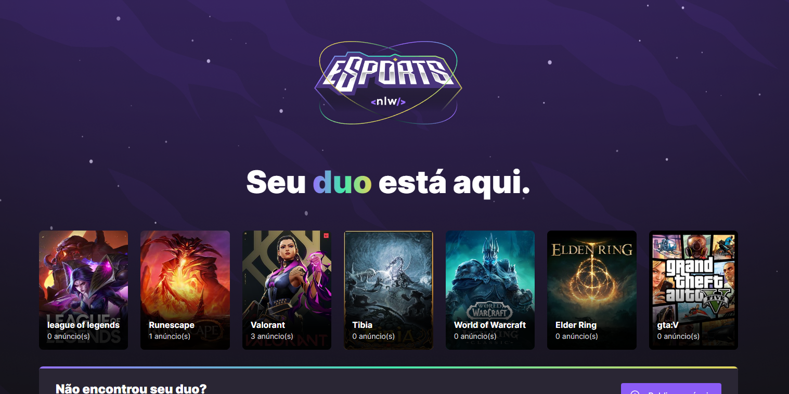

# eSports
Aplicação com node, react e react-native

## Sobre este Repositório 
Nesta aplicação foi construida uma api com o node.js, sobre onde encontrar seu "duo" para jogos online, e foi consumida com react na web e react-native no mobile
  
## Rodar a Aplicação

rode o comando:

```bash
npm run dev
```

nas pastas server e web


### template Web

<br>


